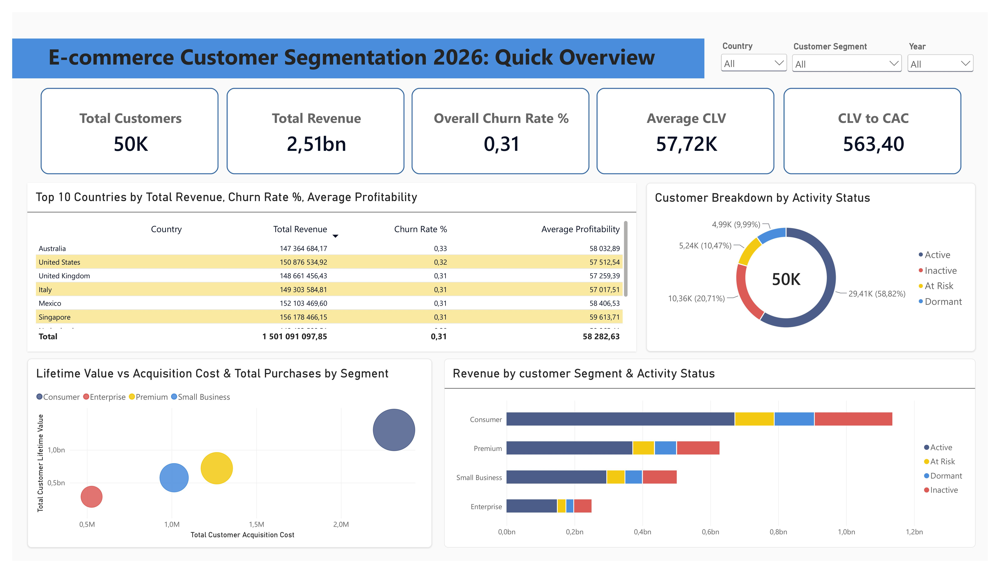
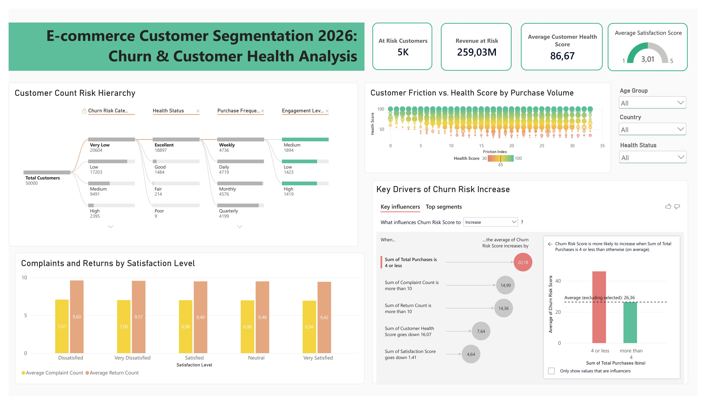
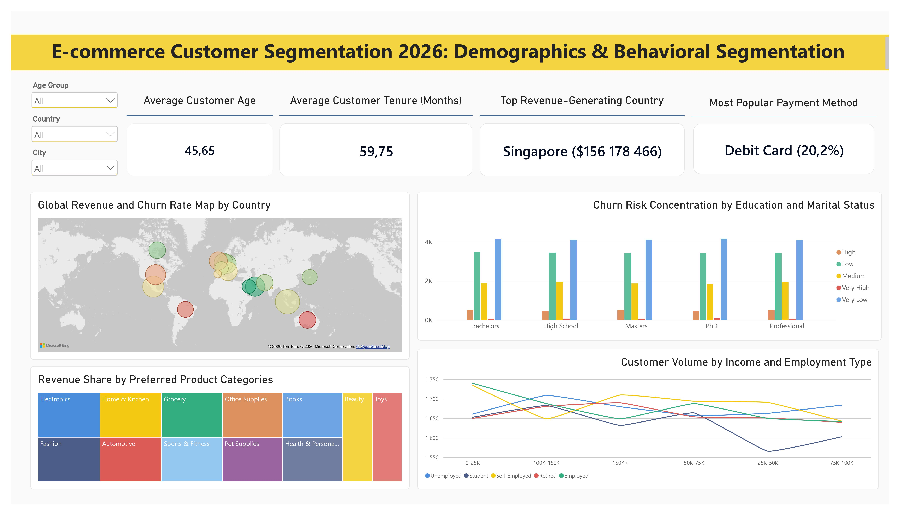
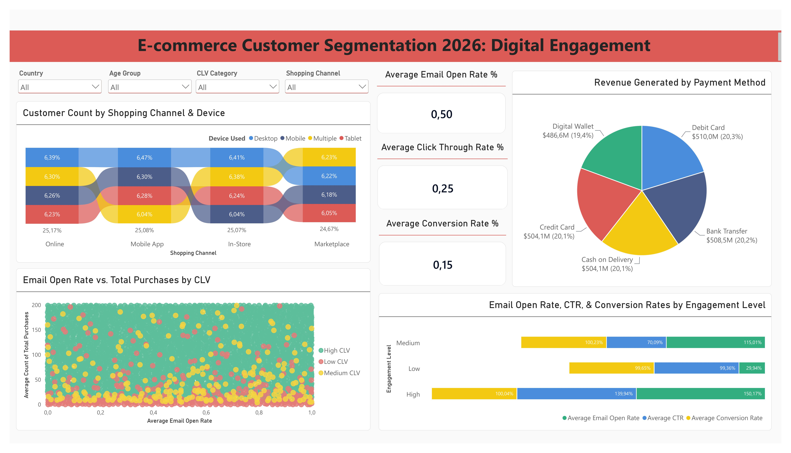

# 📊 E-commerce Customer Segmentation 2026: Power BI Dashboard

An interactive 4-page Power BI report that explores customer value, churn risk, demographics and digital engagement for 50,000 e-commerce customers. 

**Dataset:** [E-Commerce Customer Segmentation Dataset 2026](https://www.kaggle.com/datasets/datascikhan/e-commerce-customer-segmentation-2026) (Kaggle, 50,000 customers, 53 features)

---

## Dashboard Pages

### 1. Quick Overview

Headline *KPIs*: **50K customers**, **$2.51bn total revenue**, **0.31 overall churn rate**, **$57.72K average CLV** and a **CLV to CAC of 563.40**. 

*Includes* the top 10 countries by revenue, churn rate and profitability, an activity status breakdown, CLV vs. acquisition cost by segment, and revenue by segment and activity status. 

*Slicers*: Country, Customer Segment, Year.

### 2. Churn & Customer Health Analysis

*Focuses on* risk: **5K at-risk customers**, **$773.47M revenue at risk**, an **average health score of 86.67** and an **average satisfaction score of 3.01 / 5**. 

*Includes* a decomposition tree (churn risk → health status → purchase frequency → engagement), a friction vs. health score scatter plot, complaints and returns by satisfaction level, and a **Key Influencers** visual for churn risk drivers. 

*Slicers*: Age Group, Country, Health Status.

### 3. Demographics & Behavioral Segmentation

Who the customers are: **average age 45.65**, **average tenure 59.75 months**, top revenue country **Singapore ($156.2M)** and most popular payment method **Debit Card (20.2%)**. 

*Includes* a global revenue and churn map, churn risk by education level, revenue share by preferred product category (all with dropdowns), and customer volume by income and employment type. 

*Slicers*: Age Group, Country, City.

### 4. Digital Engagement

How customers interact with the brand: **50% average email open rate**, **25% click-through rate** and **15% conversion rate**. 

*Includes* customer count by shopping channel and device, revenue by payment method, email open rate vs. total purchases by CLV category, and engagement rates by engagement level. 

*Slicers*: Country, Age Group, CLV Category, Shopping Channel.

---

## Key Insights

- **Churn is significant.** 

    About **30.7%** of customers are Inactive (20.7%) or Dormant (10.0%) (the same definition is used as the churn label in the related Python project), representing **$772.57M** in revenue.. Another **10.5%** are At Risk with **$259.03M** of the same measure.
- **Purchase count is the strongest churn driver.** 
    
    In the Key Influencers visual, customers with **4 or fewer total purchases** show a churn risk score about **20 points higher**, followed by more than 10 complaints (+15.0) and more than 10 returns (+14.4).
- **Satisfaction level doesn't separate complaints or returns.** 
    
    Average complaints (~7) and returns (~9.5) are nearly identical across all five satisfaction levels.
- **Consumer is the largest revenue segment**, and Enterprise the smallest.
- **Churn is mostly mostly without major variations across countries** (0.31–0.33 among the top 10 by revenue).
- **Channels, devices and payment methods are almost evenly split** (each shopping channel holds about 25% of customers, payment methods hold 19.4–20.3% of revenue). 
    
    Behavioral variables such as purchase count and frequency separate customers far better than demographics or channel, which matches the feature importance results in the machine learning project.

---

## Data Preparation (Power Query)
 
Data was cleaned and shaped in **Power Query (M)** before any modeling or visuals were built. Power BI detected several numeric columns as text, partially because the decimal separator in the source file did not match the report's regional settings (decimal comma). Until they were fixed, these columns could not be summed or averaged.
 
**Columns corrected:**
 
| Group | Columns |
|---|---|
| Currency values (USD) | `customer_lifetime_value_usd`, `customer_acquisition_cost_usd`, `customer_profitability_usd`, `avg_order_value_usd`, `total_spent_usd` |
| Engagement rates | `email_open_rate`, `click_through_rate`, `conversion_rate` |
| Counts and Scores | `return_count`, `complaint_count`, `satisfaction_score` |
 

 ---

## Skills and Features Used
 
| Title | Where it is shown in this project |
|---|---|
| **DAX & calculated measures** | Seven custom measures using `CALCULATE`, `DIVIDE`, `COUNTROWS`, `SUM`, `AVERAGE` and `IN`, with measures built on other measures for reuse |
| **KPI design & business metrics** | Churn rate, CLV to CAC, revenue at risk, customer health, satisfaction, RFM-based segments, profitability |
| **Dashboard design & UX** | Four themed pages with a consistent layout, KPI cards at the top, clear titles and color-coded categories |
| **Filter context & interactivity** | Measures recalculate dynamically with slicers (Country, Customer Segment, Year, Age Group, CLV Category, Shopping Channel and more) and cross-visual filtering |
| **Advanced visuals** | Decomposition tree, key influencers, ribbon chart, treemap, map, gauge, scatter and bubble charts |
| **Drill-down & self-service exploration** | Decomposition tree and page-level slicers let users explore by country, city, age, segment or health status |
| **Data storytelling** | Pages move from overview to risk, then customer profile, then engagement and each answers a specific business question |
| **Business acumen & insight generation** | Findings are translated into retention priorities, such as revenue at risk and the strongest churn drivers |
| **Cross-tool analytics** | Uses the same churn definition as the Python ML project, so BI and predictive results are consistent |
 
---

## DAX Measures
 
The report uses **16 DAX measures** and **1 calculated column**. All measures are evaluated in filter context, so they respond to the page slicers, and several build on one another (for example, `Churn Rate %` uses `Churned Customers` and `Total Customers`).
 
### Core KPI measures
 
| Measure | What it calculates | DAX techniques |
|---|---|---|
| `Total Customers` | Number of customers in the current filter context | `COUNTROWS` |
| `Churned Customers` | Customers whose activity status is *Inactive* or *Dormant* | `CALCULATE`, `IN` |
| `Churn Rate %` | Churned customers as a share of all customers | `DIVIDE` (safe division), measure reuse |
| `At Risk Customers` | Customers whose activity status is *At Risk* | `CALCULATE` |
| `Total Spent USD` | Total customer spend (revenue) | `SUM` |
| `Revenue at Risk USD` | Spend of customers with an *At Risk* or *Inactive* status | `CALCULATE`, `IN` |
| `CLV_to_CAC_Ratio` | Average customer lifetime value divided by average acquisition cost | `DIVIDE`, `AVERAGE` |
 
### Aggregation measures
 
| Measure | What it calculates | DAX techniques |
|---|---|---|
| `Total Revenue` | Total customer spend, used as the revenue base for the top-country measure | `SUM` |
| `Avg Open Rate` | Average email open rate | `AVERAGE` |
| `Avg CTR` | Average click-through rate | `AVERAGE` |
| `Avg Conversion Rate` | Average conversion rate | `AVERAGE` |
| `Avg Profitability` | Average customer profitability (USD) | `AVERAGE` |
| `Avg Purchases` | Average number of purchases per customer | `AVERAGE` |
 
### Advanced & dynamic measures
 
| Measure | What it calculates | DAX techniques |
|---|---|---|
| `Customer Friction Index` | Average complaints plus average returns, a combined service-friction score used as the X-axis of the health score scatter plot | `AVERAGE`, composite metric |
| `Most Popular Payment Method + Share` | Finds the payment method with the most customers and returns text such as *Debit Card (20.2%)* for a KPI card | `VAR` / `RETURN`, `TOPN`, `VALUES`, `MAXX`, `CALCULATE`, `DIVIDE`, `FORMAT` |
| `Top Revenue Country & Amount` | Finds the country with the highest revenue and returns text such as *Singapore ($156,178,466)*, recalculating with the active filters | `VAR` / `RETURN`, `TOPN`, `VALUES`, `MAXX`, `CALCULATE`, `FORMAT`, measure reuse |
 
### Calculated column
 
| Column | What it does | DAX techniques |
|---|---|---|
| `churn_risk_sort` | Assigns each churn risk category a numeric rank (Very High = 1 … Very Low = 5, anything else = 6), so categories can be ordered by severity instead of alphabetically | `SWITCH` |
 
Other KPI cards (average customer age, tenure, health score and satisfaction score) use Power BI's built-in field aggregations.

---

## Related

- [Churn prediction notebook and ML models](https://github.com/berliniryna/churn_prediction), which builds the machine learning models on the same data.
